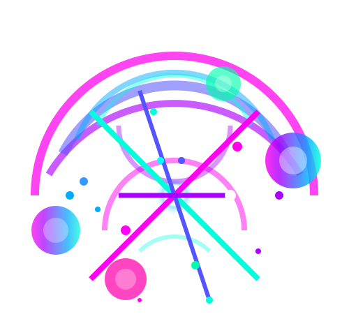

<p align="center">
  
  <h1 style="{font-size: 20px}">AURORA</h1>
</p>

Aurora is a social media platform built using Next.js, designed for seamless user interactions with dummy data fetched from [dummyjson.com](https://dummyjson.com). It allows users to register, scroll through posts, view profiles, follow users, like posts, and comment on them.

## Features

- User authentication using dummy data (not real authentication)
- View and interact with posts
- Follow and unfollow users
- Like and comment on posts
- Responsive UI with modern design

## Tech Stack

- **Frontend:** Next.js (React), Tailwind CSS
- **Backend (API):** Dummy data from [dummyjson.com](https://dummyjson.com)
- **State Management:** React Hooks

## Setup & Installation

### Prerequisites

Ensure you have Node.js installed on your system.

### Steps to run the project

1. Clone the repository:
   ```bash
   git clone https://github.com/theutpal01/Aurora.git
   cd Aurora
   ```
